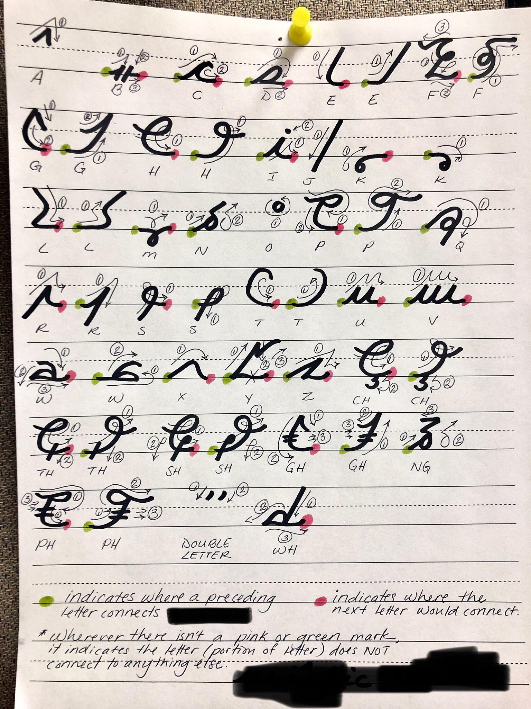
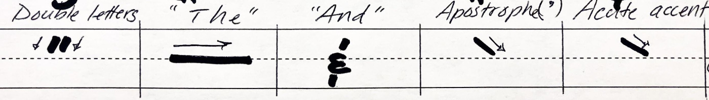
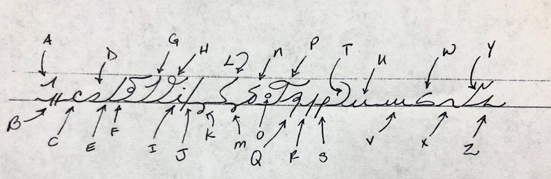
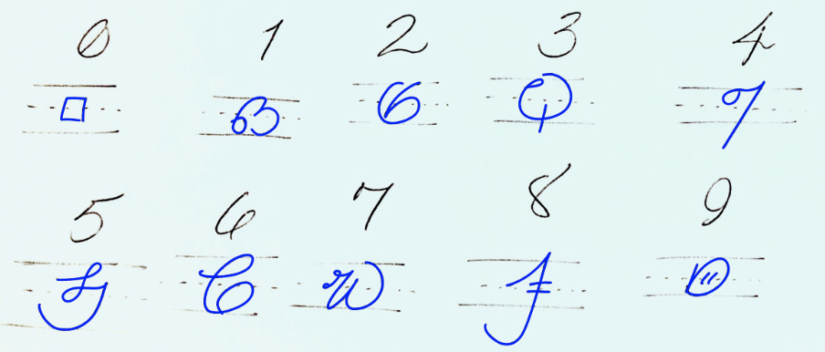
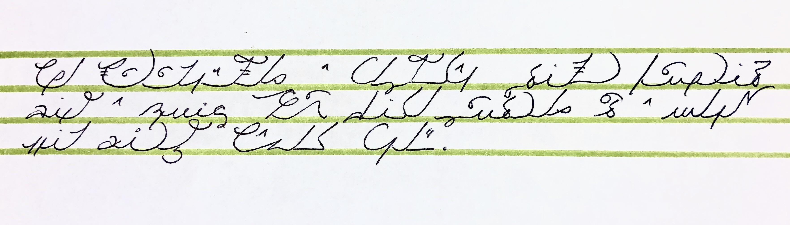
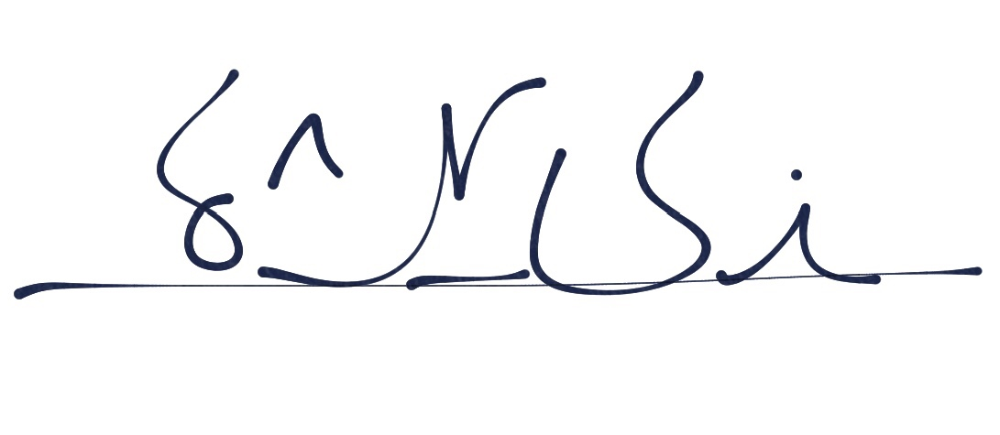
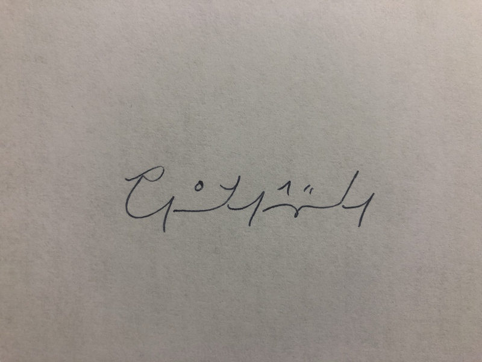

# Introduction

**Vianaic** is a written script. It is pronounced: "*vee-ah-NAY-ick*". It is not a new language. It is a different way of writing. It can be used to write English or any of the languages that uses the 26 letters of the Latin alphabet. It is loosely based off of Arabic script and Roman letters. 

People use Vianaic for different reasons. Often it is used for journaling as a way to obfuscate the prose.

## Origin

Vianaic was created by Reddit user [u/vilhjalmurengi](https://reddit.com/u/vilhjalmurengi). It was mentioned for the first time in [this reddit thread](https://www.reddit.com/r/Handwriting/comments/7x3hki/i_originally_created_this_script_its_not_a/). As a follow up to that post, the subreddit [/r/vianaic](https://reddit.com/r/vianaic) was created.

[/u/vilhjalmurengi](https://reddit.com/u/vilhjalmurengi):

> I created it about 6 or 7 years ago [~2012]. It is one of many scripts I have learned/created since I was a young boy. This particular one, Vianaic, is the one that I've kept to most strongly probably because of its ease and I just like the way it flows. I didn't have a very good reason for creating it, other than I find it to be a fun hobby/time-killer in between patient appointments at the hospital where I work as an interpreter. It's also a good way to keep things secret that I write down, for whatever reason… sometimes for things like personal journal entries. It's loosely based off of the Arabic script. And that's about it!

## V1 vs. V2

There are 2 versions of Vianaic: V1 and V2. **For the sake of simplicity: this website is about V2 for now**.

V1 is the original version and it is the prettier of the two, with its long, swooping and low-hanging letters. V2 is the updated Vianaic which removed many of the low-hanging letters and replaced them with letters that stay at/or above baseline. The purpose of this was to minimize overlapping if you have intended to use Vianaic for journaling or anything which would require multiple horizontal lines of text.

## About this website

This is not an official website per se. Specifications, tips, history, examples and references are scattered all over Reddit. This website is an effort to compile as much information as possible into one coherent and comprehensive document.

## Contributing

Everyone is welcome to contribute to this document. You only need a [github account](https://github.com). Head to [github.com/paulrouget/vianaic.github.io](https://github.com/paulrouget/vianaic.github.io) to make or suggest changes.

## Where to ask questions

It is recommended to ask questions about Vianaic on Reddit: [/r/vianaic/](https://reddit.com/r/vianaic) or on Discord: [discord.gg/cvK2Jgk](https://discord.gg/cvK2Jgk). Questions or issues about this website can be submited [here](https://github.com/vianaic/vianaic.github.io/issues).

# Learn Vianaic

## References and specifications

**Note:** One does not have to follow the reference and the specifications stricly. Because it is often used for personal writing, feel free to adapt these rules to your liking. Reddit is filled with examples of Vianaic variants.

### Characters Table

*Notes: do not use the bottom line of the Y letter if it is not connecting to anything (at the end of a word).*

### Specifications

1. Latin characters `a` to `z` and digits `0` to `9` have an equivalent in Vianaic.
2. Some pairs of letters (called *diagraph*, like `ph`, `th`, `ng`, …) have their own character.
3. The words `The` and `And` have their own character.
4. A pair of same letters (like in `Eggs` or `Asset`) is combined into one letter followed by a double-tick character.
5. There are no capital letters.
6. Punctuation does not change.
7. Characters can have 0, 1 or 2 connecting points. Connecting characters according to these points form an uninterupted stroke. Words are made of one or multiple strokes.
8. Characters can have 2 forms: Initial or Final. Picking the right form makes the word flow better.

### Initial and Final form

Vianaic *flows*. Letters connect to give words this beautiful cursive look. To ensure the letters flow properly, many letters have 2 forms: *Initial* and *Final*. Usually it is just a flipped version of the symbol (like the Latin letters `d` and `b`).

*Initial* letters connect with the following letter. *Final* letters connect with the previous letter. As a consequence: *Initial* letters are used at the beginning of a word, and *Final* letters are used at the end of the word.

The word `lentil` would start with a *Initial* `L` and end with a *Final* `L`.

Inside a word, it is up to the writer to use the form that connects the best. Use the form that is easier to move into from the previous symbol. For example, the letter that follows a `m` should use the Final form. The letter after a `j`, should use the Initial form.

### When to write `o` and `a`

In regular writing, we often dot the letter `i` after we finished writing the whole word. Similarly, the `o` and the `a` letters, being floating characters, can be added subsequently to not interrupt the stroke.

For example, in the word EAT, it is easier to write `e` and `t` in one stroke, then add the `a` in between.

## How to practice

Practicing writing is pretty straight forward. Pick any text and start writing.

test

Reading is a bit more tricky. There is not much reading material yet, and people tend to use their own variant, making sharing prose difficult. [You can use this font](https://github.com/paulrouget/vianaic-font/) that makes any online text readable in Vianaic.

In the mean time we put tother some examples below.

## Gallery

### From the creator

**Move your mouse over the image for a translation.**

A Vianaic pangram (phrase composed of all the letters in the alphabet, including all diagraphs):

* [K vs. M example](./imgs/creator/km.jpg)
* [Long prose](./imgs/creator/randomness.jpg)
* [Long prose 2](./imgs/creator/001.jpg)
* [Foot and boot](./imgs/creator/foot_boot.jpg)
* [Still, sheet, think, getting](./imgs/creator/still_sheet_think_getting.jpg)

### Videos

* [From creator](https://www.reddit.com/r/vianaic/comments/av5377/quote_about_kindness_its_very_true/)
* [Showcasing speed](https://www.reddit.com/r/vianaic/comments/akn4j8/this_is_how_fast_i_can_write/)
* [Journaling](https://www.reddit.com/r/vianaic/comments/atafvx/journaling_is_more_interesting_this_way/)

### Featured community posts

These are (mostly) valid, English and non-variant examples shared by the community on Reddit.

* [u/Pixel8edRevelry](https://www.reddit.com/r/vianaic/comments/crx922/my_very_first_attempt_at_vianaic_i_love_how/)
* [u/sweetpotatofamily](https://www.reddit.com/r/vianaic/comments/cgo71n/bored_postsurgery_hand_writing_practice_concrit/)
* [u/roseuhmatoes](https://www.reddit.com/r/vianaic/comments/c8klho/this_is_my_first_time_writing_anything_other_than/)
* [u/Squirrelgirlfanatic](https://www.reddit.com/r/vianaic/comments/c5bju1/my_attempt_at_v2/)
* [u/201-](https://www.reddit.com/r/vianaic/comments/buthdz/taking_steps/)
* [u/Garnetit](https://www.reddit.com/r/vianaic/comments/bsda3e/wrote_some_random_nonsense_instead_of_sleeping/)
